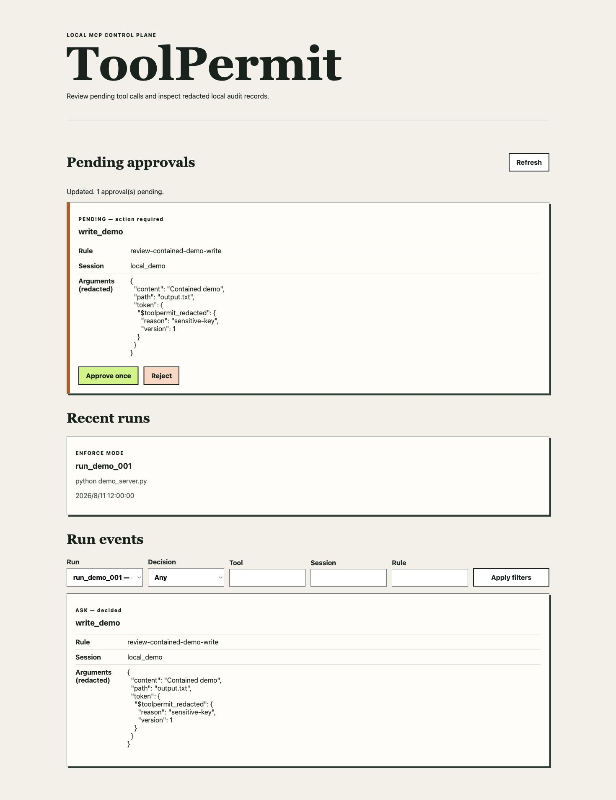

# ToolPermit 中文介绍

ToolPermit 是一个面向 MCP 工具调用的本地优先权限策略、一次性审批和脱敏审计层。它放在
MCP Client 与本地 `stdio` Server 之间，可以观察工具调用、执行可解释的
`allow / ask / deny` 规则、审批例外操作，并使用历史记录离线比较候选策略。

> 当前版本：[PyPI v0.1.0](https://pypi.org/project/toolpermit/0.1.0/)，并提供内容匹配的
> [GitHub Release](https://github.com/sunhao123456sun-svg/toolpermit/releases/tag/v0.1.0)。

英文 [README.md](README.md) 和英文参考文档是项目契约的权威版本；本文件提供中文功能说明与
快速上手。

## 核心功能

- 严格、带版本的 YAML 策略；未知字段会报错，按从上到下首次匹配决定结果。
- 审批与准确的请求、策略、会话和过期时间绑定，只能原子消费一次。
- 凭证形态和敏感字段在进入 SQLite、页面和 JSONL 导出前不可逆脱敏。
- 使用已脱敏的历史调用离线回放新策略，不启动 MCP Server，也不会执行真实工具。
- 所有核心能力都可通过 CLI 使用；可选网页界面只监听本机回环地址，并实施
  Host、Origin、CSRF、CSP 和 SameSite 防护。
- 在 Ubuntu、macOS、Windows 和 Python 3.11–3.13 上持续测试。



## Codex Skill

可以直接从本 GitHub 仓库安装 ToolPermit Codex Skill：

```bash
codex plugin marketplace add sunhao123456sun-svg/toolpermit --ref main
codex plugin add toolpermit@toolpermit
```

安装后新建一个 Codex 任务，然后输入：

```text
使用 $toolpermit 安装 ToolPermit，并用观察模式安全包装我的本地 MCP stdio Server。
```

Skill 会检查 Python 和 ToolPermit，在获得允许后安装依赖，保留已有文件，并在写入
MCP Client 配置前展示变更。它默认先使用 `observe`，不会自动切换到 `enforce`，也不会
代替用户审批调用。完整安装、更新和删除方法见英文 [Codex Skill 指南](docs/codex-skill.md)。

## 十分钟快速上手

需要 Python 3.11–3.13；运行仓库自带的受控演示时还需要项目源码：

```bash
python -m venv .venv
.venv/bin/python -m pip install "toolpermit==0.1.0"
.venv/bin/toolpermit init
```

Windows PowerShell 请把 `.venv/bin/` 换成 `.venv\Scripts\`。

先运行观察模式。演示 Server 只会写入你明确提供的可抛弃目录：

```bash
mkdir demo-workspace
.venv/bin/python examples/demo_client.py \
  --mode observe \
  --demo-dir demo-workspace
.venv/bin/toolpermit runs list
```

随后体验审批。下列命令会在写文件前等待：

```bash
.venv/bin/python examples/demo_client.py \
  --mode enforce \
  --policy toolpermit.yaml \
  --demo-dir demo-workspace
```

在另一个终端查看并批准准确请求：

```bash
.venv/bin/toolpermit approvals list
.venv/bin/toolpermit approvals approve APPROVAL_ID
```

也可以运行 `.venv/bin/toolpermit ui`，在 `http://127.0.0.1:8765` 使用本地审批页面。
完整的策略建议、回放、导出和清理流程见英文 [Quickstart](docs/quickstart.md)。

## 重要边界

v0.1 只承诺本机单用户、MCP `stdio`、策略 schema v1 和审计 schema v1。ToolPermit
**不是操作系统沙箱**，无法看到绕过代理的调用，不能撤销已经执行的操作，也不声称可以消除
符号链接或 TOCTOU 等文件系统竞态。网页界面不支持远程绑定。

在保护破坏性工具之前，请阅读英文 [安全模型](docs/security.md)、
[隐私与数据生命周期](docs/privacy.md) 和 [已知限制](docs/limitations.md)。

## 开发

```bash
.venv/bin/python -m pip install -e ".[dev]"
.venv/bin/ruff check src tests examples scripts benchmarks plugins
.venv/bin/pyright
.venv/bin/python scripts/check_codex_plugin.py
.venv/bin/pytest --cov=toolpermit --cov-fail-under=70
```

项目采用 [Apache License 2.0](LICENSE)。问题反馈与贡献方式见
[SUPPORT.md](SUPPORT.md) 和 [CONTRIBUTING.md](CONTRIBUTING.md)。
