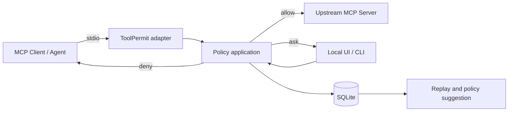
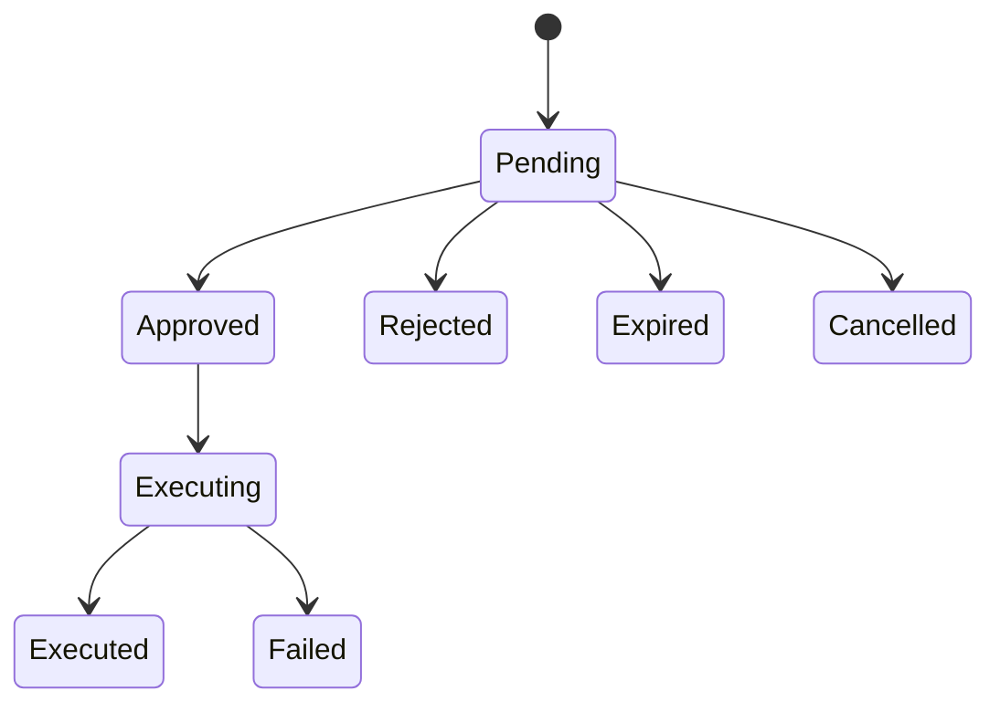

# Architecture

> Status: Proposed architecture for technical spikes  
> Rule: Architecture choices become binding only after Phase 1 validation and an accepted ADR.

## Chinese executive summary

ToolPermit 采用“协议适配层 + 规范化事件 + 纯策略核心 + 审批状态机 + 脱敏存储 + 回放/建议工具”的分层设计。核心策略引擎不能依赖 Web、数据库或具体 Agent 框架；这样既方便测试，也能在未来接入其他协议。第一版使用 Python 单体应用和 SQLite，而不是微服务。

前端只是本地操作界面，不拥有独立安全逻辑。CLI 和 Web 必须调用同一套应用服务。MCP `stdio` 是 v0.1 唯一承诺的传输方式，Streamable HTTP 要在后续重新审视认证、Origin、Host、会话和 DNS rebinding 风险后再支持。

## Architectural goals

- Keep policy evaluation deterministic and side-effect free.
- Separate protocol parsing from policy semantics.
- Use one canonical tool-call representation throughout the lifecycle.
- Make replay possible without an agent, client, or upstream server.
- Keep v0.1 deployable as one local process and one local database.
- Preserve a path to new adapters without prematurely building a plugin framework.

## Context



## Component model

### 1. MCP stdio adapter

Responsibilities:

- Launch and supervise the configured upstream process.
- Parse and validate supported MCP/JSON-RPC messages.
- Preserve request IDs, cancellation, and response ordering across modern discovery and legacy initialization paths.
- Forward non-tool messages according to a documented compatibility rule.
- Convert supported tool calls into normalized domain objects.
- Convert domain outcomes back into protocol responses.

Must not:

- Implement policy precedence.
- Persist raw messages directly.
- Decide approval state on its own.

### 2. Tool catalog and schema fingerprinting

Responsibilities:

- Capture normalized tool metadata returned by the upstream server.
- Calculate a stable fingerprint from security-relevant schema fields.
- Detect tool additions, removals, and schema changes within a session.
- Provide the fingerprint to policy, approval, and audit components.

The fingerprint indicates structural change; it does not prove tool implementation integrity.

### 3. Canonicalization and redaction boundary

Two related representations are required:

- **Execution request:** validated canonical data sufficient to forward the exact call.
- **Persisted event:** redacted representation safe enough for storage and replay.

The approval digest is calculated from the execution request before secrets are discarded, but raw digest inputs are not persisted. The digest must use a documented canonical serialization and keyed or domain-separated hashing where appropriate.

### 4. Policy engine

Properties:

- Pure input/output API.
- No database, network, subprocess, UI, or clock access except injected evaluation context.
- Versioned policy schema and precedence algorithm.
- Returns decision, matched rule ID, explanation, policy digest, and diagnostic facts.
- Rejects invalid or unsupported policies before enforcement starts.

Conceptual API:

```python
DecisionResult evaluate(
    ToolCall call,
    ToolDefinition tool,
    Policy policy,
    EvaluationContext context,
)
```

### 5. Approval service

Responsibilities:

- Create pending records for `ask` decisions.
- Enforce expiry and single-use semantics.
- Apply atomic lifecycle transitions.
- Resume the exact suspended call or return a terminal rejection.
- Expose the same operations to CLI and local HTTP API.

Suggested state machine:



No transition may return from a terminal state to an executable state.

### 6. Event store

v0.1 choice: SQLite with versioned migrations.

Responsibilities:

- Store redacted run, tool, policy, decision, approval, and outcome records.
- Support filtered inspection and deterministic export.
- Provide transactional approval transitions.
- Keep schema version and application version metadata.

Non-responsibilities:

- Store raw prompts.
- Store recoverable secrets.
- Act as a distributed queue.

### 7. Replay engine

Responsibilities:

- Load persisted events into policy-engine inputs.
- Evaluate without connecting to an upstream server.
- Compare baseline and candidate policies.
- Classify transitions: unchanged, newly allowed, newly gated, newly denied, evaluation error.
- Produce human-readable and machine-readable reports.

Replay validates policy decisions, not the actual future effect of an upstream tool.

### 8. Policy suggestion engine

v0.1 must be deterministic and rules-based.

Responsibilities:

- Group selected events by tool and schema fingerprint.
- Suggest exact or narrow argument constraints.
- Surface conflicts and insufficient evidence.
- Attach evidence references to generated rules.
- Write only to a new inactive candidate file.

### 9. Application service layer

Coordinates:

- Mode selection.
- Policy loading and validation.
- Adapter lifecycle.
- Approval suspension/resume.
- Storage and replay commands.
- Effective configuration.

This is the only layer permitted to orchestrate side effects across components.

### 10. CLI

- Must expose all core workflows.
- Must work without building or opening the web UI.
- Uses structured exit codes and optional JSON output for automation.
- Never implements a second policy or approval path.

### 11. Local web UI

- Approval and run-inspection client over a loopback HTTP API.
- Static assets may be bundled into the Python distribution.
- Uses escaped structured rendering, restrictive CSP, CSRF protection, and Host/Origin validation.
- Non-loopback binding is refused unless a future supported authentication configuration is present.

## Proposed package boundaries

```text
src/toolpermit/
  domain/          # immutable types, decisions, state definitions
  policy/          # parser, validation, evaluator, explanation
  protocol/mcp/    # stdio adapter and MCP conversion
  approvals/       # lifecycle and transactional service
  audit/           # redaction, storage, export, migrations
  replay/          # offline evaluation and diff
  suggest/         # deterministic candidate generation
  application/     # orchestration use cases
  cli/             # Typer commands
  web/             # FastAPI endpoints and bundled UI serving
```

Dependency direction:

```text
CLI / Web / MCP adapter
          ↓
Application services
          ↓
Domain + Policy core

Infrastructure implements interfaces owned by the application/domain layers.
```

The policy core must not import the MCP SDK, FastAPI, SQLite driver, or UI packages.

## Runtime modes

### Observe

- Proxy supported calls without enforcement.
- Evaluate policy optionally for comparison, but never present the result as enforced.
- Persist redacted evidence.
- Display a persistent non-enforcement warning.

### Enforce

- Require a valid active policy at startup.
- Evaluate every supported call.
- Fail closed on policy or application errors.

### Replay

- Start no upstream process.
- Perform no real tool calls.
- Read selected recorded events and candidate policies only.

## Data model sketch

Key entities:

- `Run`: one adapter execution context.
- `Connection`: ToolPermit-owned transport correlation boundary; an MCP session ID is optional adapter metadata because the 2026 protocol does not require sessions.
- `ToolDefinition`: name, normalized schema, fingerprint, first/last seen.
- `ToolCallEvent`: canonical metadata and redacted arguments.
- `PolicySnapshot`: version, digest, origin, activation status.
- `DecisionRecord`: decision, rule, explanation, diagnostics.
- `ApprovalRequest`: request digest, state, expiry, actor, timestamps.
- `ExecutionRecord`: upstream timing, terminal state, redacted result metadata.

Persistent IDs should be opaque and sortable where useful; none should embed secrets.

## Configuration hierarchy

Proposed precedence:

1. Explicit CLI flags.
2. Environment variables for approved runtime overrides.
3. Project configuration file.
4. Safe built-in defaults.

The effective configuration command must show each value's source and mask secrets.

## Technology decisions to validate

| Area | Proposed default | Phase 1 question |
|---|---|---|
| Language | Python 3.11+ | Are process and stdio semantics reliable on Windows? |
| Packaging | uv + Hatchling | Can UI assets be built and included reproducibly? |
| MCP | Official Python SDK 2.x | Can the adapter preserve cancellation and correlation across modern and legacy protocol paths? |
| CLI | Typer | Are async lifecycle and structured errors clean? |
| API | FastAPI | Can loopback security defaults be enforced simply? |
| UI | React/Vite | Is the maintenance cost justified for v0.1? |
| Storage | SQLite | Can approval transitions be made safely across supported systems? |
| Policy | Strict YAML + Pydantic | Can canonical semantics remain understandable and stable? |

## Observability

- Structured local logs with event IDs, never raw secrets.
- Separate application diagnostics from redacted audit events.
- Debug logging must require explicit opt-in and remain subject to redaction.
- No outbound telemetry in v0.1.
- Benchmarks measure policy and persistence overhead separately from upstream duration and human approval time.

## Extension strategy

Do not create a general plugin system in v0.1. Add narrow interfaces only where a second implementation is planned or needed for testing:

- Protocol adapter interface.
- Event store interface.
- Clock/ID providers for deterministic tests.
- Policy export interface only when the first real export adapter is accepted.

## Architecture decision records

- [ADR-001](adr/ADR-001-mcp-stdio-mediation.md): MCP mediation strategy and supported message set.
- [ADR-002](adr/ADR-002-approval-canonicalization.md): Canonical serialization and approval digest.
- [ADR-003](adr/ADR-003-policy-precedence.md): Policy precedence and matching semantics.
- [ADR-004](adr/ADR-004-approval-transactions.md): Approval transaction and crash-recovery behavior.
- [ADR-005](adr/ADR-005-local-ui.md): UI technology and package distribution.
- [ADR-006](adr/ADR-006-audit-redaction.md): Audit data minimization and redaction contract.

## Phase 1 validated updates

- MCP 2.0.0 and the 2026-07-28 `server/discover` path are current targets; legacy initialization remains a compatibility path.
- Correlation is ToolPermit-owned (`run_id`/`connection_id`), not dependent on a protocol session.
- The v0.1 UI should use bundled framework-free assets instead of React/Vite.
